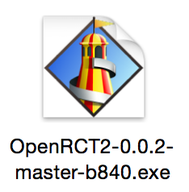

# QLWindowsExecutable

A quick look generator for Windows executables (.exe files). It does not actually generate quick look windows but generates thumbnails, so windows files look like this in the Finder:

